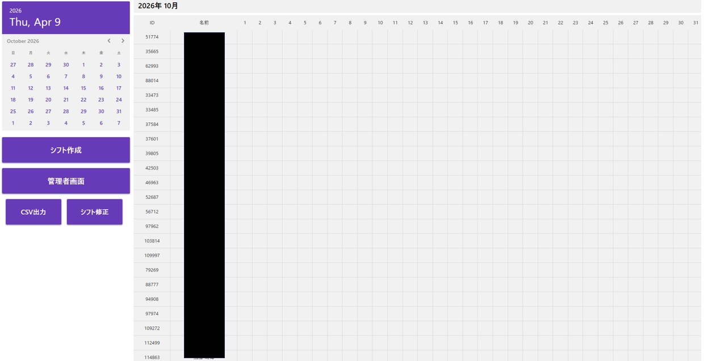
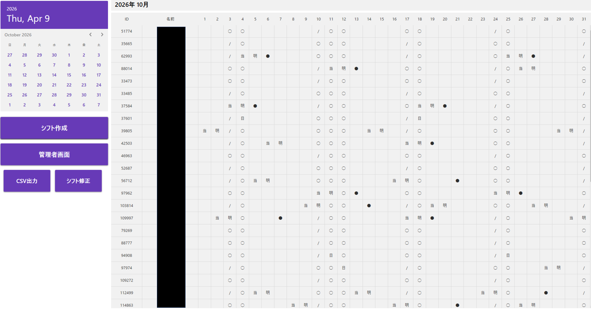
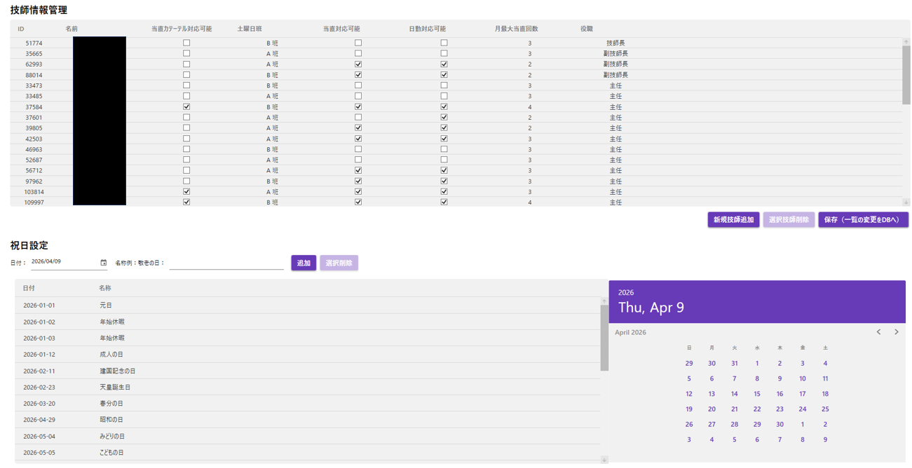
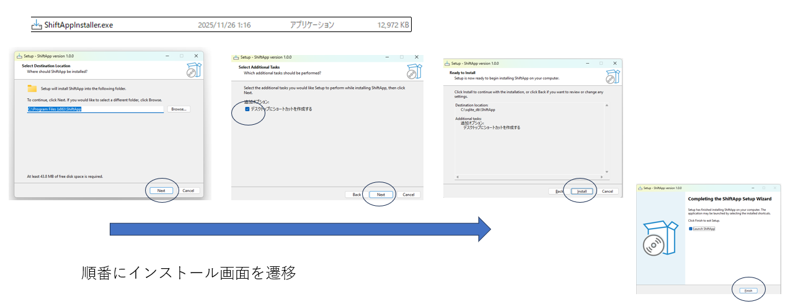

#  シフト管理アプリ（WPF / C# ）

## 概要
本プロジェクトは、医療現場における勤務シフト作成を効率化するための  
**シフト管理アプリケーション**です。

---

##  目的
- シフト作成の自動化・効率化
- 人的ミスの削減
- 公平性の担保（当直回数・制約条件）
- 管理者による柔軟な編集機能の提供

---

## 技術スタック
- 言語：C#
- フレームワーク：WPF（MVVM）
- データベース：SQLite
- ログ：Serilog

---

## 主な機能

### ① シフト自動生成
- 当直・日勤などの勤務割り当て
- 制約条件を満たすスケジュール生成
- 公平性（勤務回数）の考慮

---

### ② シフト手動編集
- セルクリックで勤務シンボル選択
- 修正内容をDBへ保存
- UIから直感的に操作可能

---

### ③ 管理者機能
- 技師の登録・編集・削除
- 祝日の登録・管理
- 当直回数制限の設定

---

### ④ ログ機能
- シフト生成処理のログ出力
- 不具合解析・トラブルシュート対応

---

### ⑤ インストーラー対応
- Windows環境での配布用インストーラー作成
- Program Filesへの配置対応

---

##  シフトロジック（重要）
- 当直可能 / 不可の制約
- 勤務間隔制約（連続当直防止）
- 当直回数の上限管理
- ランダム性＋公平性の両立

---

##  工夫点
- WPF + MVVMでUIとロジックを分離
- SQLiteにより軽量で配布可能な構成
- ログ機能により実運用を意識

---

## ⚠️ 課題
- 複雑な制約条件に対する完全最適化は未対応  
      OR-Toolsで最適化予定
- UI/UXの改善余地あり
- エッジケースでの組み合わせバグ
- 大規模データでの計算時間最適化

---

##  今後の展望
- CSPベースのロジック強化
- シフト最適化アルゴリズムの改善
- UIの改善（ドラッグ操作など）
- クラウド対応・Web化

---

## 📂 ディレクトリ構成（例）
Shiftapp_demo/  
├── Business/ # シフト作成ロジック  
├── Csv/ # CSV入出力関連  
├── Data/ # 初期データ・DBファイル  
├── DataAccess/ # SQLiteアクセス処理  
├── FrameWork/ # 共通基盤クラス  
├── Helper/ # 補助処理  
├── Models/ # データモデル  
├── Output/ # 出力結果  
├── Resources/ # 画像・静的リソース  
├── Utils/ # 汎用ユーティリティ  
├── ViewModels/ # MVVMロジック  
├── Views/ # UI  
└── README.md  

---

##  デモ画面

### シフト画面

## 作成 ↓

### 管理者画面

### インストーラー

##  想定ユースケース
- 医療機関のシフト管理
- 当直スケジュール作成
- 勤務負担の均等化

---

